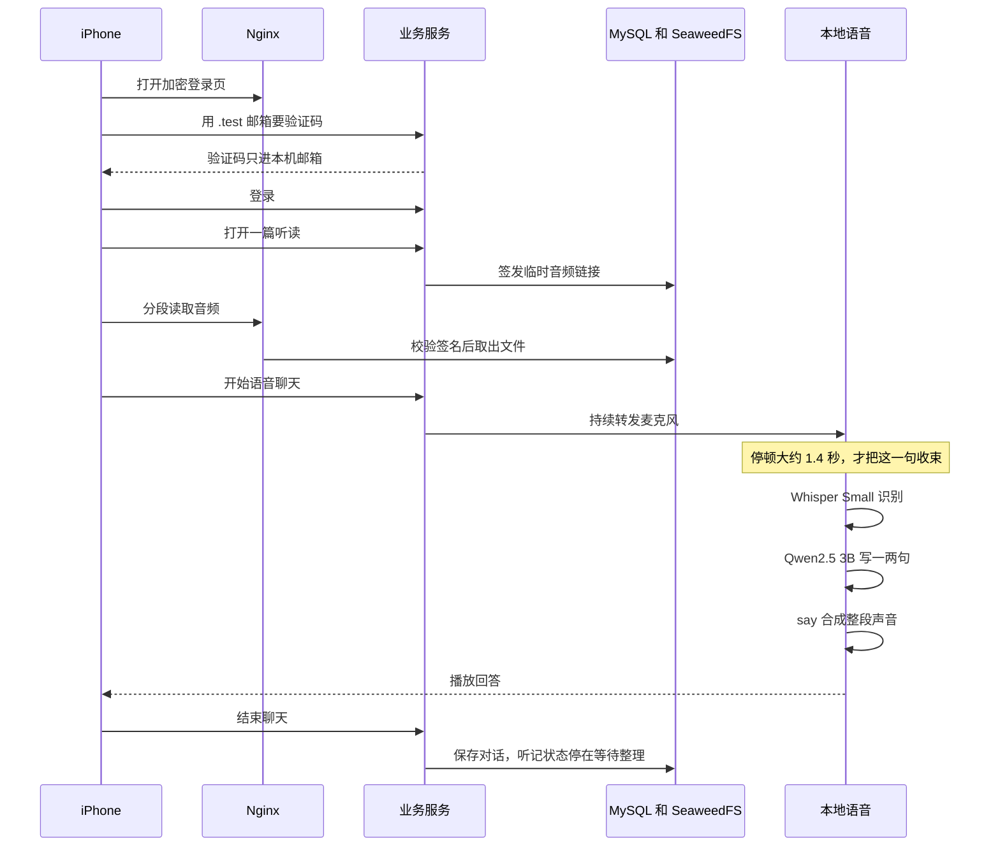

# 当前流程

这是手机从登录到一次聊天结束的顺序。识别和回答都发生在这台 Mac 上。

```mermaid
sequenceDiagram
  participant Phone as iPhone
  participant Nginx as Nginx
  participant Engine as 业务服务
  participant Store as MySQL 和 SeaweedFS
  participant Voice as 本地语音

  Phone->>Nginx: 打开加密登录页
  Phone->>Engine: 用 .test 邮箱要验证码
  Engine-->>Phone: 验证码只进本机邮箱
  Phone->>Engine: 登录
  Phone->>Engine: 打开一篇听读
  Engine->>Store: 签发临时音频链接
  Phone->>Nginx: 分段读取音频
  Nginx->>Store: 校验签名后取出文件
  Phone->>Engine: 开始语音聊天
  Engine->>Voice: 持续转发麦克风
  Note over Voice: 停顿大约 1.4 秒，才把这一句收束
  Voice->>Voice: Whisper Small 识别
  Voice->>Voice: Qwen2.5 3B 写一两句
  Voice->>Voice: say 合成整段声音
  Voice-->>Phone: 播放回答
  Phone->>Engine: 结束聊天
  Engine->>Store: 保存对话，听记状态停在等待整理
```

一句说完后会多等大约 1.4 秒。这个等待是为了不把长句子在换气时切断。回答要等本机模型写完，再由系统语音整段读出，所以听起来会慢一拍。

结束页可以重新查询听记。本地没有开启整理程序，状态会一直停在“正在整理”，页面文字不变。
